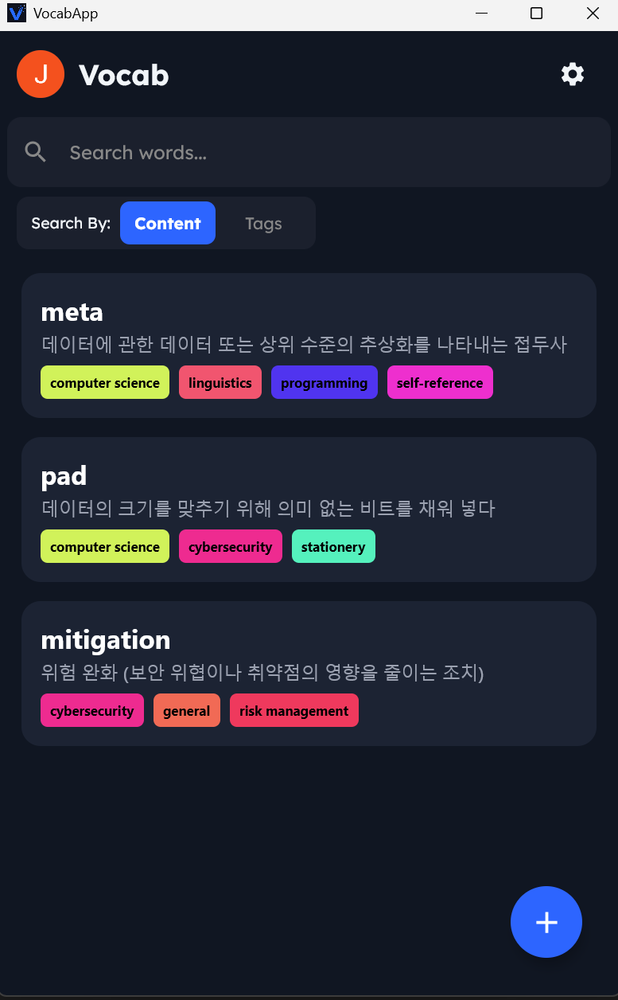
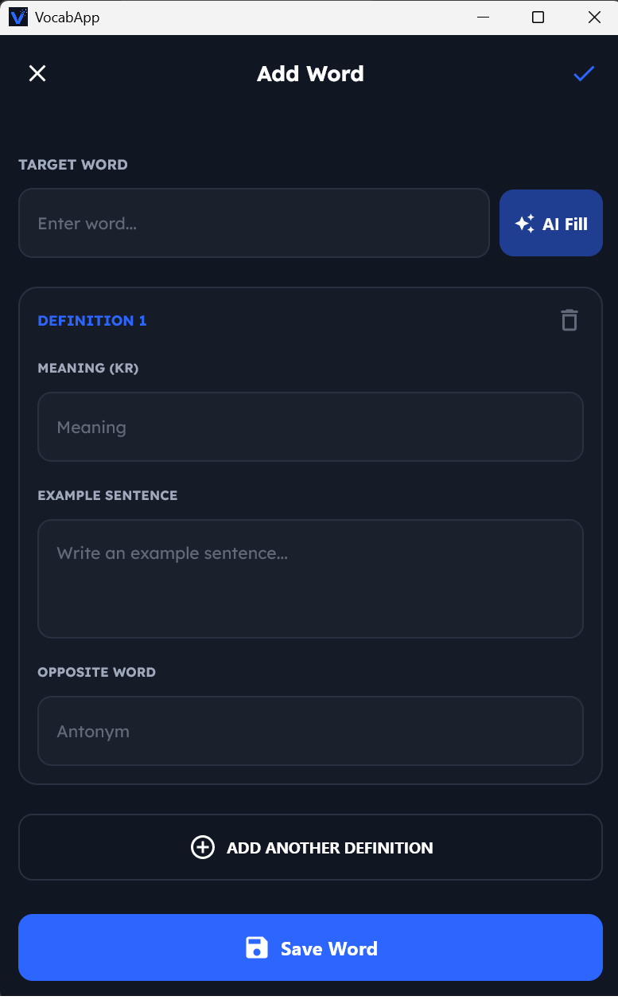
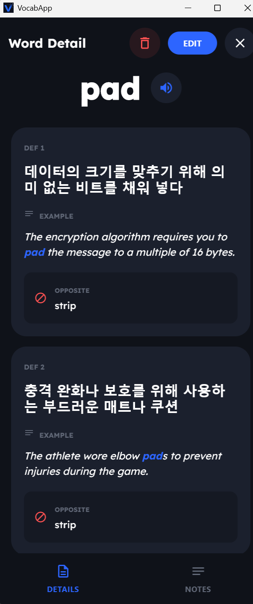
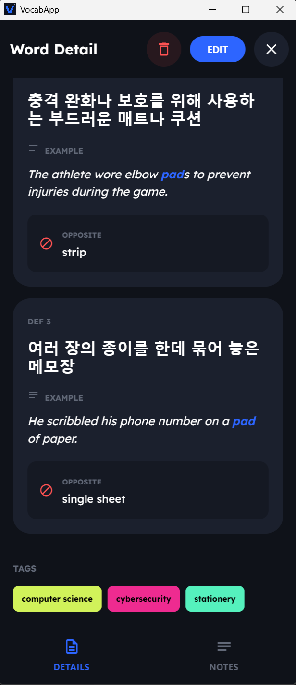
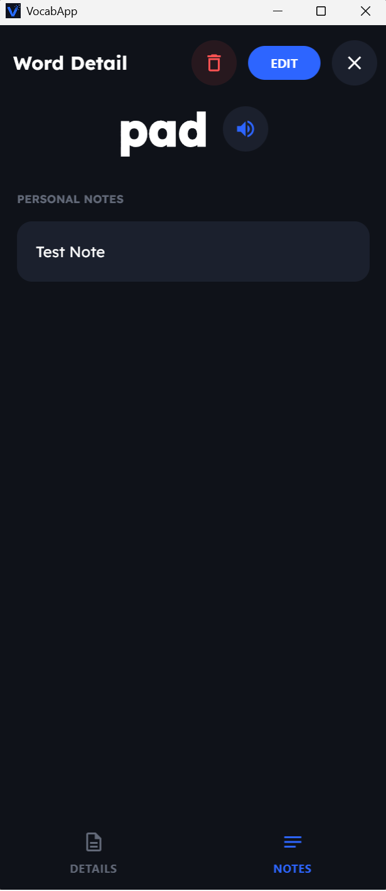
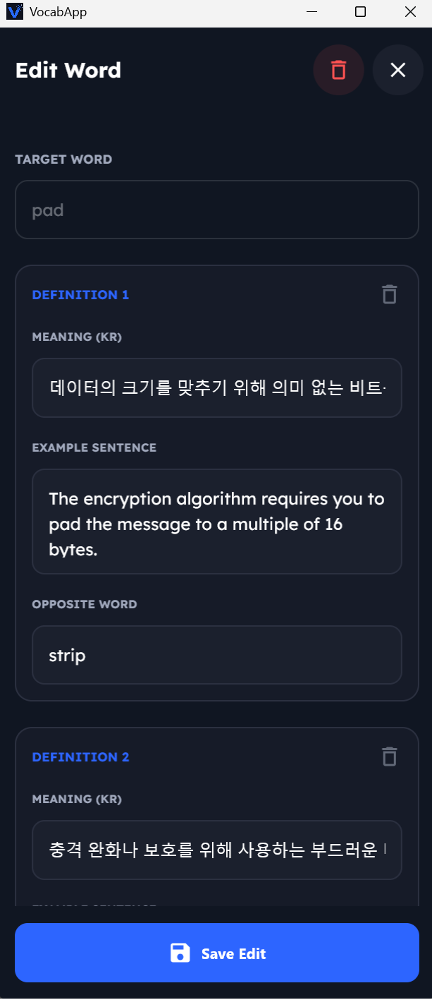
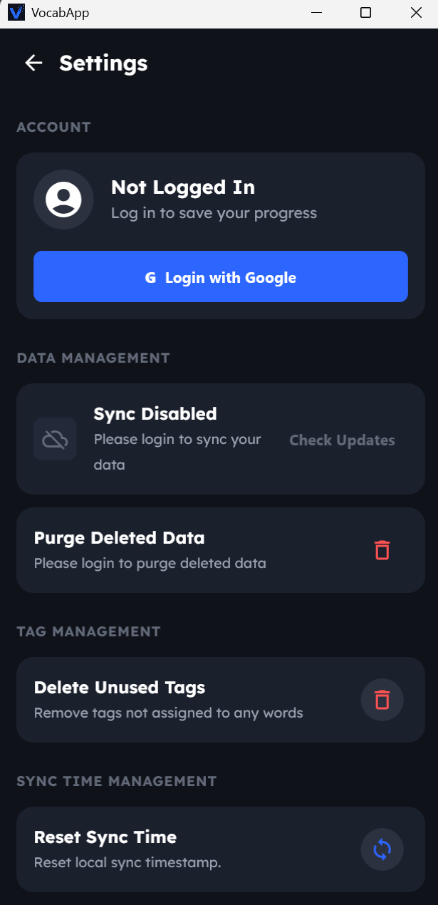
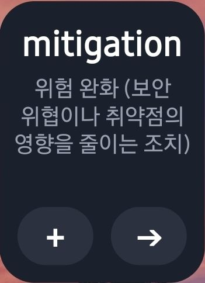

# Vocab 🎯

A modern, multiplatform vocabulary application designed for seamless word management and AI-assisted word knowledge generation. Built with **Kotlin Multiplatform** and **Compose Multiplatform**

## Target Platforms
- Android
- Windows

## ✨ Key Features

-   **🤖 AI-Powered Content**: Automatically generates translations, example sentences, and antonyms using **Google Gemini**.
-   **🔄 Cloud Synchronization**: Real-time data sync between Android and Windows via **Turso (LibSQL)**.
-   **📱 Android Widget**: Review your vocabulary at a glance with **Jetpack Glance** widgets.
-   **🔐 Secure Auth**: Built-in **Google Sign-In** for easy account management and data backup.
-   **🔊 Text-to-Speech**: Listen to pronunciations directly within the app (Android).
-   **🎨 Material 3 Design**: A clean, modern interface with a custom theme based on the Lexend font.

## Screenshots

## 🛠 Tech Stack

-   **Framework**: [Compose Multiplatform](https://www.jetbrains.com/lp/compose-multiplatform/)
-   **Database**: [SQLDelight](https://cashapp.github.io/sqldelight/) (Local) & [Turso](https://turso.tech/) (Cloud)
-   **Network**: [Ktor](https://ktor.io/)
-   **DI**: [Koin](https://insert-koin.io/)
-   **AI**: [Google Gemini API](https://ai.google.dev/)
-   **Widgets**: [Jetpack Glance](https://developer.android.com/jetpack/compose/glance)
-   **Authentication**: Google Sign-In using [KMAuth](https://github.com/sunildhiman90/KotlinMultiplatformAuth)
-   **Windows Encryption**: Data Protection API (DPAPI) (via JNA Crypt32)
-   **Android Encruption**: [Google Tink](https://github.com/tink-crypto/tink) 
-   **Secure Storage**: [Jetpack DataStore](https://developer.android.com/jetpack/androidx/releases/datastore?hl=ko)
-   **TTS (Text-to-Speech)**: Android Native TextToSpeech & Windows SAPI (via PowerShell System.Speech)

## External Resources

-   **Font**: [Lexend](https://fonts.google.com/specimen/Lexend) (SIL Open Font License)
-   **Icons**: [Material Symbols](https://fonts.google.com/icons)

---
[View Project Tasks](task.md)

---
[Backend Github Repository](https://github.com/CA-JunPark/Vocab-Backend-Python)
